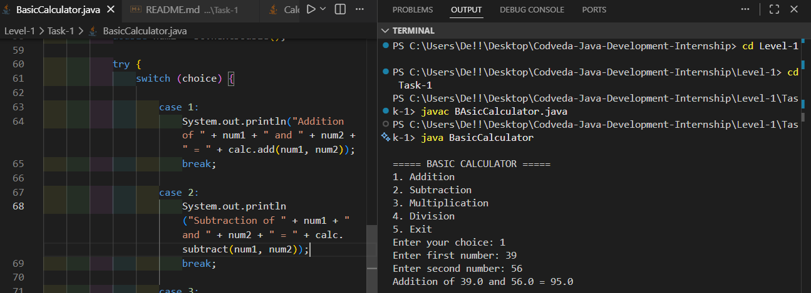
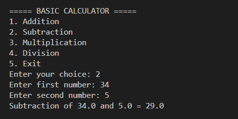
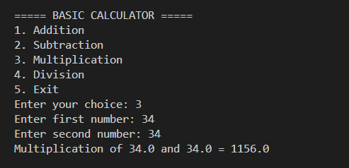
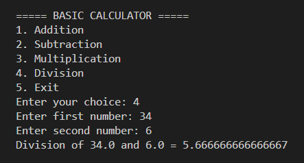
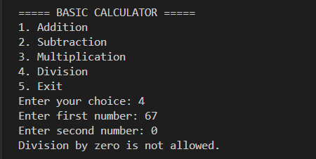

# Basic Calculator

## Project Description

This is a simple Java console application that performs basic arithmetic operations.

The calculator allows users to:

- Add two numbers
- Subtract two numbers
- Multiply two numbers
- Divide two numbers

The application runs continuously until the user chooses the Exit option.

---

## Features

- Object-Oriented Programming (Class and Methods)
- User-friendly menu
- Addition, Subtraction, Multiplication, Division
- Division by zero handling
- Input validation for invalid menu choices
- Runs until the user exits

---

## Technologies Used

- Java
- Scanner Class
- Exception Handling
- Loops
- Methods

---

## How to Run

1. Compile the program:

```bash
javac BasicCalculator.java

## Screenshots

### Addition


### Subtraction


### Multiplication


### Division


### Division By Zero
