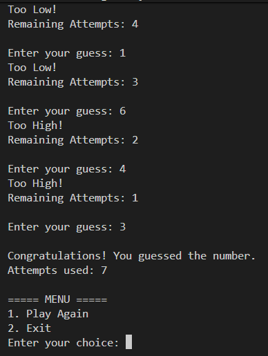
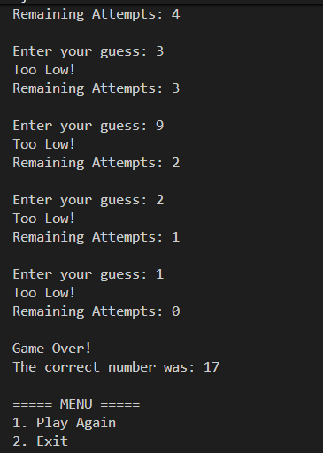
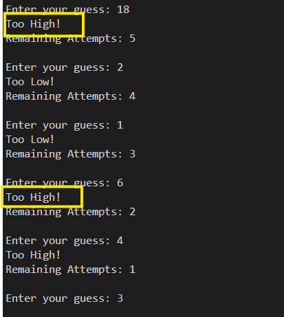
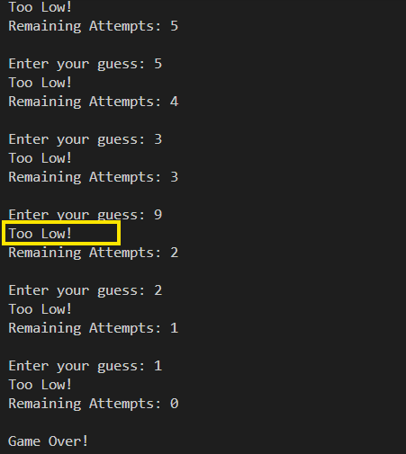

# Number Guessing Game

## Project Description

This is a Java console-based Number Guessing Game.

The program generates a random number between 1 and 100, and the player has to guess the correct number within a limited number of attempts.

The game provides hints such as:

- Too High
- Too Low

and handles invalid user input.

## Features

- Random number generation using Random class
- Limited number of attempts
- Too High / Too Low feedback
- Invalid input handling
- Object-Oriented Programming

## Technologies Used

- Java
- Random Class
- Loops
- Conditional Statements
- Exception Prevention
- Scanner Class

## How to Run

```bash
javac NumberGuessingGame.java
java NumberGuessingGame

```

## Screenshots

### Winning the Game


### Game Over


### too-high!


### too-low!
