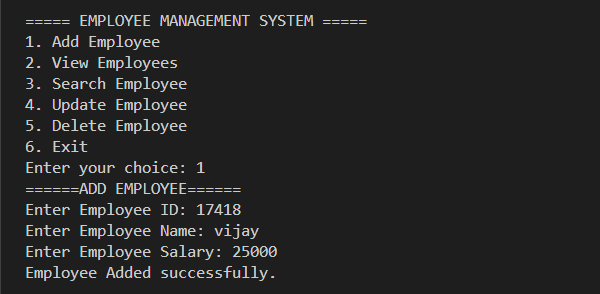
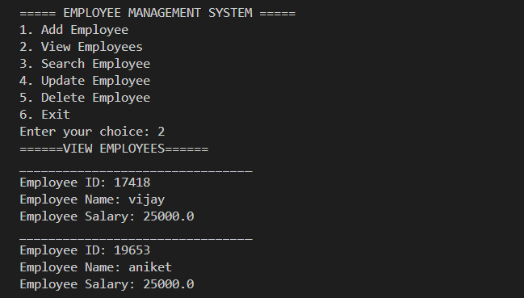
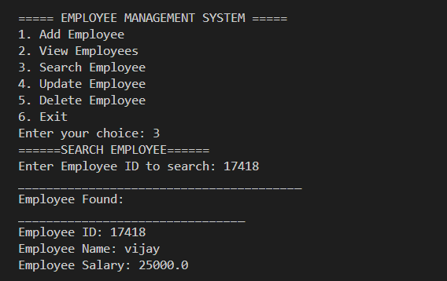
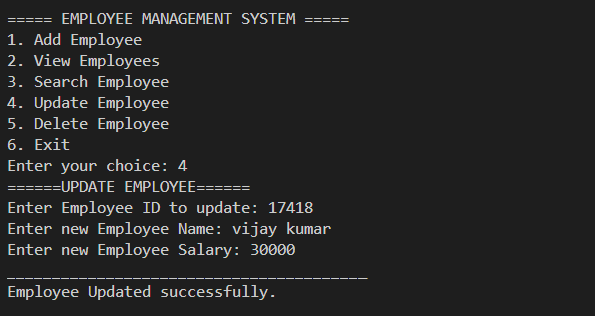
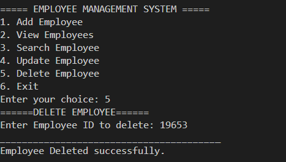
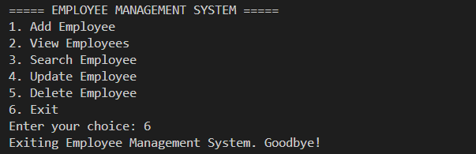

# Employee Management System

## Project Description

This is a Java console-based Employee Management System developed using Object-Oriented Programming (OOP) concepts.

The application allows users to manage employee records by performing CRUD operations:

- Create (Add Employee)
- Read (View Employees)
- Update Employee Details
- Delete Employee Records

Employee data is stored in an ArrayList during program execution.

---

## Features

- Add Employee
- View All Employees
- Search Employee by ID
- Update Employee Information
- Delete Employee Record
- Prevent Duplicate Employee IDs
- Menu-Driven Interface
- Input Validation
- Exit Option

---

## Technologies Used

- Java
- OOP (Object-Oriented Programming)
- ArrayList
- Scanner Class
- Loops
- Conditional Statements

---

## Project Structure

```text
EmployeeManagementSystem.java
```

---

## How to Run

1. Compile the program:

```bash
javac EmployeeManagementSystem.java
```

2. Run the program:

```bash
java EmployeeManagementSystem
```

---

## Sample Menu

```text
===== EMPLOYEE MANAGEMENT SYSTEM =====

1. Add Employee
2. View Employees
3. Search Employee
4. Update Employee
5. Delete Employee
6. Exit
```

---

## Screenshots

### Add Employee


### View Employee


### Search Employee


### Update Employee


### Delete Employee


### Exit


---

## Learning Outcomes

Through this project, I learned:

- Java Classes and Objects
- Encapsulation
- ArrayList Operations
- CRUD Functionality
- Method Creation
- User Input Handling
- Object-Oriented Programming Concepts

---

## Author

Vijay Kumar Dholpuria

Java Development Intern
Codveda Technology