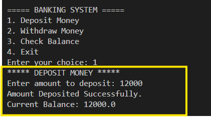
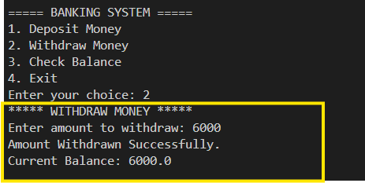
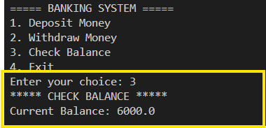
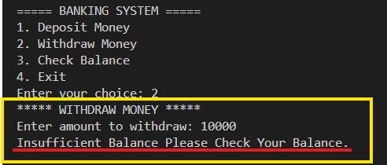
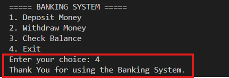

# Banking Application

## Project Description

This is a Java console-based Banking Application developed using Object-Oriented Programming concepts.

The application allows users to:

- Deposit Money
- Withdraw Money
- Check Account Balance

The system also handles invalid transactions and insufficient balance situations.

---

## Features

- Deposit Money
- Withdraw Money
- Check Balance
- Insufficient Balance Handling
- Input Validation
- Menu-Driven Interface
- Exit Option

---

## Technologies Used

- Java
- OOP (Object-Oriented Programming)
- Scanner Class
- Loops
- Conditional Statements

---

## How to Run

```bash
javac BankingApplication.java
java BankingApplication
```

---

## Screenshots

### Deposit Money


### Withdraw Money


### Check Balance


### Insufficient Balance


### Exit


---

## Learning Outcomes

- Classes and Objects
- Encapsulation
- Methods
- Loops
- User Input Handling
- Error Handling
- Banking Operations Logic

---

## Author

Vijay Kumar Dholpuria

Java Development Intern