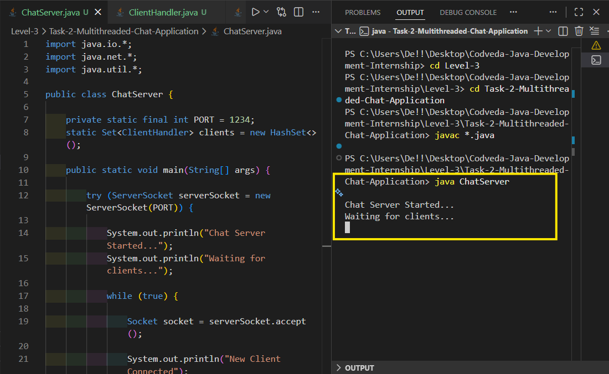
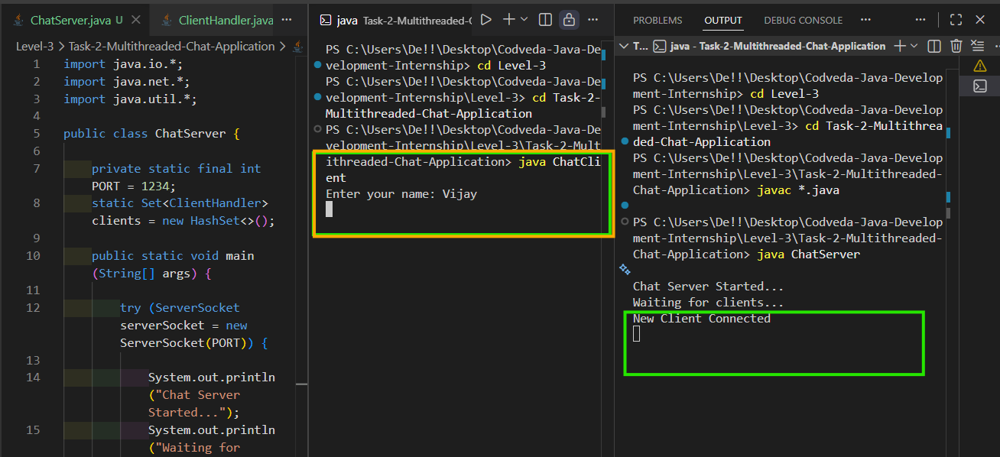
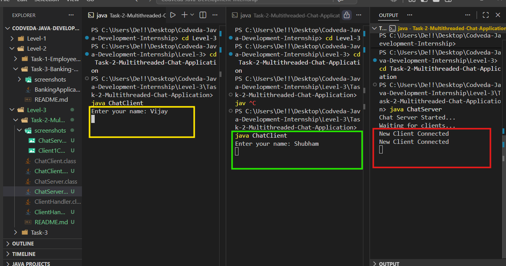
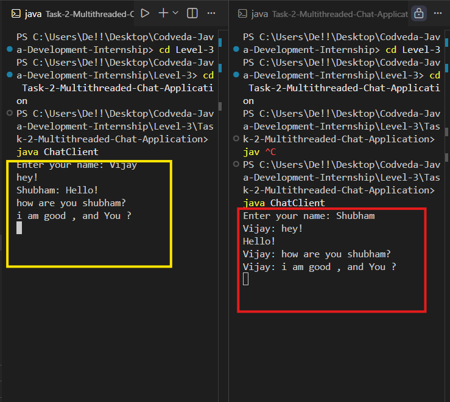

# Multithreaded Chat Application

## Project Description

This is a console-based Multithreaded Chat Application developed using Java Socket Programming and Multithreading.

The application allows multiple clients to connect to a server and communicate with each other in real time. Messages sent by one client are broadcast to all connected clients.

---

## Features

- Server-Client Communication
- Multiple Clients Support
- Real-Time Messaging
- Message Broadcasting
- Multithreading
- Console-Based Interface
- Socket Programming

---

## Technologies Used

- Java
- Socket Programming
- Multithreading
- Networking
- BufferedReader
- PrintWriter

---

## Project Structure

```text
Task-2-Multithreaded-Chat-Application
│
├── ChatServer.java
├── ClientHandler.java
├── ChatClient.java
├── README.md
└── screenshots
```

---

## How to Run

### Compile All Files

```bash
javac *.java
```

### Start the Server

```bash
java ChatServer
```

### Start Client 1

```bash
java ChatClient
```

### Start Client 2

```bash
java ChatClient
```

---

## Working

1. The server starts and waits for client connections.
2. Clients connect to the server using sockets.
3. A new thread is created for each connected client.
4. Clients can send messages.
5. Messages are broadcast to all connected clients.
6. Multiple clients can chat simultaneously.

---

## Screenshots

### Chat Server Started


### Client 1 Connected


### Client 2 Connected


### Clients Chatting With Each Other


---

## Learning Outcomes

Through this project, I learned:

- Java Socket Programming
- Client-Server Architecture
- Multithreading
- Real-Time Communication
- Network Programming
- Message Broadcasting
- Concurrent Programming Concepts

---

## Author

### Vijay Kumar Dholpuria

Java Development Intern  
Codveda Technology

GitHub Repository:  
https://github.com/vijaydholpuria/Codveda-Java-Development-Internship