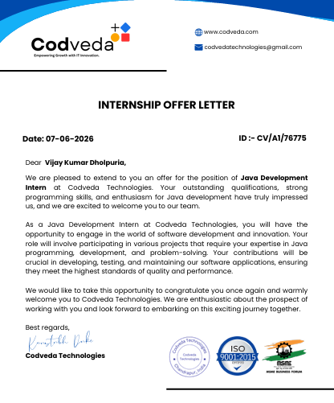

# Codveda Java Development Internship

## Internship Offer Letter



---

## About This Repository

This repository contains all projects completed during my **Java Development Internship at Codveda Technology**.

The projects are organized level-wise and focus on improving Java programming skills, Object-Oriented Programming (OOP), problem-solving, collections, exception handling, and real-world application development.

---

## Internship Progress

### Level 1 - Basic

- ✅ Task 1: Basic Calculator
- ✅ Task 2: Number Guessing Game
- ⬜ Task 3: Factorial using Recursion

### Level 2 - Intermediate

- ✅ Task 1: Employee Management System
- ⬜ Task 2: File Handling (Read and Write)
- ✅ Task 3: Banking Application

### Level 3 - Advanced

- ⬜ Task 1: Library Management System with JDBC
- ⬜ Task 2: Multithreaded Chat Application
- ⬜ Task 3: Binary Search Tree (BST) Implementation

---

## Project Structure

```text
Codveda-Java-Development-Internship
│
├── offer-letter
│   └── offer-letter.jpg
│
├── Level-1
│   ├── Task-1-Basic-Calculator
│   └── Task-2-Number-Guessing-Game
│
├── Level-2
│   ├── Task-1-Employee-Management-System
│   └── Task-3-Banking-Application
│
├── Level-3
│
└── README.md
```

---

## Skills & Concepts Covered

### Core Java

- Classes and Objects
- Constructors
- Methods
- Encapsulation
- Collections Framework
- Exception Handling
- Input Validation

### Object-Oriented Programming

- Classes
- Objects
- Encapsulation
- Method Reusability
- Data Abstraction

### Problem Solving

- CRUD Operations
- Banking Operations
- Random Number Generation
- User Input Validation
- Menu-Driven Applications

---

## Technologies Used

- Java
- OOP Concepts
- Collections Framework
- ArrayList
- Exception Handling
- Scanner Class
- JDBC
- Multithreading
- Data Structures

---

## Completed Projects

### 🔹 Basic Calculator

A console-based calculator that performs:

- Addition
- Subtraction
- Multiplication
- Division
- Division by Zero Handling

### 🔹 Number Guessing Game

A Java game where users guess a randomly generated number.

Features:

- Random Number Generation
- Too High / Too Low Feedback
- Limited Attempts
- Input Validation
- Play Again Option

### 🔹 Employee Management System

A CRUD-based employee management application.

Features:

- Add Employee
- View Employee
- Search Employee
- Update Employee
- Delete Employee

### 🔹 Banking Application

A simple banking system developed using OOP concepts.

Features:

- Deposit Money
- Withdraw Money
- Check Balance
- Insufficient Balance Handling

---

## Learning Outcomes

Through this internship, I gained practical experience in:

- Java Programming
- Object-Oriented Programming
- Collections Framework
- Exception Handling
- CRUD Operations
- Console-Based Application Development
- Problem Solving and Logical Thinking

---

## Author

### Vijay Kumar Dholpuria

**Java Development Intern**  
Codveda Technology

📧 GitHub Repository:  
https://github.com/vijaydholpuria/Codveda-Java-Development-Internship

---

⭐ Thank you for visiting this repository. Feel free to explore the projects and provide feedback.